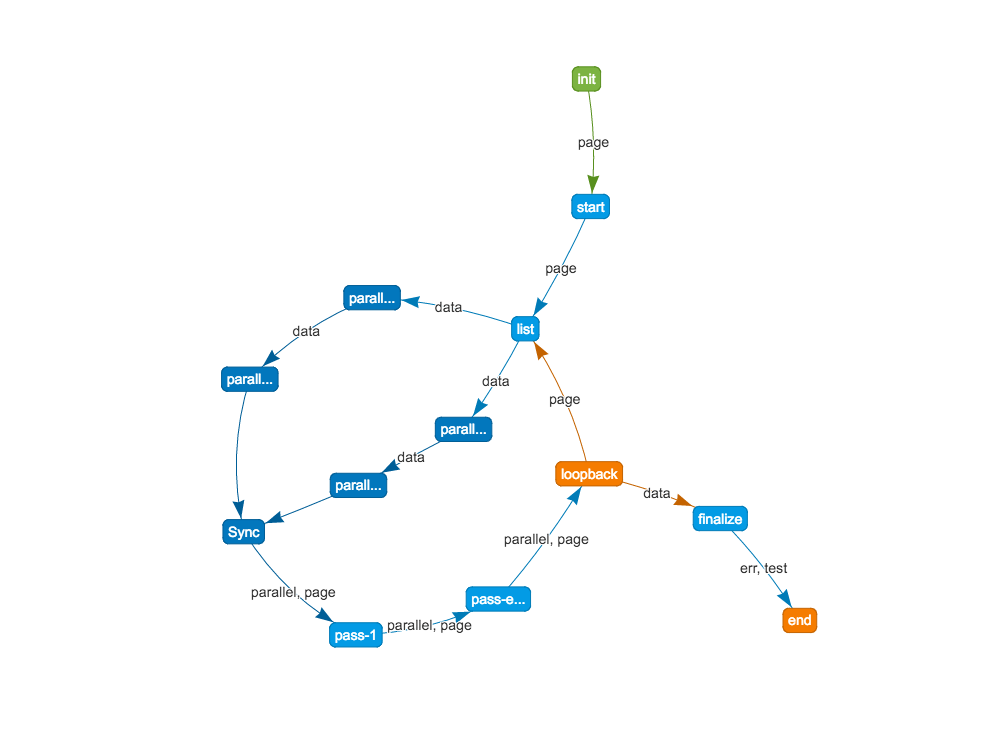

`flowpipe` is installable via:

- npm: `npm install flowpipe --save`

## Promise Based Flowpipe: upper v0.5.0

- v0.5.0 is based on `Promise` Object, so not support previous version.
- for using older version, `let flowpipe = require('flowpipe').older`

### Quick Start

```javascript
'use strict';

const Flowpipe = require('flowpipe');

let myWork = (args)=> new Promise((resolve)=>{
    args.data2.push(Math.random());
    setTimeout(resolve, 5);
});

let flowpipe = Flowpipe.instance('MyWork');
flowpipe
    // set arguments
    .init((args)=> args.index = 0)
    .init((args)=> args.data1 = [])
    .init((args)=> args.data2 = [])
    .init((args)=> args.data3 = [])
    // set work, name as work-1
    .then('work-1', (args)=> new Promise((resolve)=> {
        args.data1.push(Math.random());
        setTimeout(resolve, 5);
    }))
    // set work, set name as myWork
    .then(myWork)
    // set work, set auto created name 
    .then((args)=> new Promise((resolve)=> {
        args.data3.push(Math.random());
        setTimeout(resolve, 5);
    }))
    // loop back to work-1 if args.index < 100 and increase args.index 
    .loop('work-1', (args)=> ++args.index < 100)
    // print something
    .log((args)=> `data1 data2 data3 / ${args.data1.length} ${args.data2.length} ${args.data3.length}`)
    // set parallel max thread
    .maxThread(30)
    // set parallel
    .parallel((args)=> args.data1, (args, data, idx)=> new Promise((resolve)=> {
        setTimeout(()=> {
            resolve();
        }, data * 1000);
    }))
    // print timestamp
    .timestamp((total, premodule)=> `total: ${total}ms, parallel ${premodule}ms`)
    // run
    .run();
```
  
### Document

- Flowpipe.instance(name)
    - `return` Flowpipe instance
    - such as `let myjob = require('flowpipe').instance('myJob')`
- instance.init(setterFn)
    - set instance's local variables
    - `setterFn(args)`: must sync function, not async.
        - such as `instance.init((args)=> args.data = [])`
- instance.log(printFn)
    - print log
    - `printFn(args)`: must have return string
- instance.timestamp(printFn)
    - print timestamp
    - `printFn(total, preModule)`: must have return string
- instance.then(name, work)
    - add some work
    - also, `then, add, pipe`
    - `name(optional)`: work name for loop back 
    - `work`: work function, 
- instance.loop(workname, condition)
    - also, `loop, for, loopback`
    - `workname`: target to loopback 
    - `condition`: must have return boolean
- instance.maxThread(number)
    - set parallel max thread
- instance.parallel(which, work)
    - `which`: must have return array
    - `work`: work function (args, data, idx)

---

## Older Flowpipe: v0.4.0

### Quick Start: v0.4.0



```javascript
var flowpipe = require('flowpipe').older;

flowpipe
    .init(function (next) {
        // init before start
        var page = 1;
        next(null, page);
    })
    .pipe('start', function (next, page) {
        // page is that previous next function's variable
        setTimeout(function (err) {
            // next is function that proceed next pipe, parallel or loopback
            next(err, page);
        }, 1000);
    })
    .pipe('list', function (next, page) {
        console.log('start page: ' + page);
        // preparing list for parallel
        var list = [{no: 1}, {no: 2}, {no: 3}];
        for (var i = 0; i < list.length; i++) {
            list[i].page = page;
            list[i].delay = 3 - i; // delay time in parallel process
        }
        // next before parallel, pass only second parameter to parallel process.
        // second parameter must be array.
        // other parameters pass to next pipe or loopback.
        next(null, list, page);
    })
    .parallel('parallel process', function (next, data) {
        // data is indicating each of list items.
        setTimeout(function () {
            data.title = 'title-' + data.no;
            next(null, data);
        }, data.delay * 1000);
    })
    .parallel('parallel process 2', function (next, data) {
        // data is indicating each of list items.
        setTimeout(function () {
            data.title = 'title-' + data.no;
            next(null, data);
        }, data.delay * 1000);
    })
    .parallel('multi-thread', function (next, data) {
        // this option {multiThread: true} makes your function async.
        // in node.js's single thread, navie logic is processing by single thread.
        // if you use this, all of logics are processing in multi thread.
        // ***WARNING: use only local variables or parameters from previous pipe.
        //           do not use global, or functional objects from previous pipe.
        for(var i=0;i<100000000;i++) ;
        next(null, data);
    }, {multiThread: true})
    .pipe('pass-1', function (next, parallel, page) {
        console.log('pass-1');
        next(null, parallel, page);
    })
    .pipe('pass-else', function (next, parallel, page) {
        console.log('pass-else');
        next(null, parallel, page);
    })
    .loopback('pipe-list', function (loop, next, instance, parallel, page) {
        // loopback(process_type-process_name, fn)
        // - process_type: pipe, parallel
        // - process_name: must defined
        // - fn(loop, next, instance, others...)
        //   - loop(err, variables...): passing variable to target process
        //   - next(err, variables...): proceeding if loop ended
        //   - instance: maintainable variable in loop, object type {}
        //   - others: passed from before process
        if (!instance.data) instance.data = [];
        for (var i = 0; i < parallel.length; i++)
            instance.data.push(parallel[i]);
        if (page < 5) loop(null, page + 1);
        else next(null, instance.data);
    })
    .pipe('finalize', function (next, data) {
        next(null, data);
    })
    .end(function (err, test) {
        // end(callback) or end()
        // this must be declared, if not all function don't working.
        // proceed in the end or occured error in process
    })
    .graph('./basic-example-graph.html');
```

### Documents: v0.4.0

- flowpipe.init(work)
    - initialize variables
    - params
        - `work`: function(next)
            - `next`: function(err, arg1, arg2 ...)
                - callback for next work. must be execute this function in callback.
- flowpipe.pipe(name, work)
    - params
        - `name`: current work's name
        - `work`: function(next, arg1, arg2 ...)
            - `next`: function(err, arg1, arg2 ...)
            - `args`: previous work's results
- flowpipe.parallel(name, work, opts)
    - processing work in parallel.
    - params
        - `name`: current work's name
        - `work`: function(next, list_item, args ...)
            - `next`: function(err, item)
                - `item`: sync items to list
            - `list_item`: parameter in previous work's first variable. must be array in previous.
            - `args`: previous work's results, not array
        - `opts`:
            - multiThread: default `false`
- flowpipe.loopback(target, work)
    - params
        - `target`: jump to, `function`-`name`
        - `work`: function(loop, next, instance, args ...)
            - `loop`: function(err, args ...), when loop continue
            - `next`: function(err, args ...), when loop end
            - `instance`: maintenance variable in loop
- flowpipe.end(work)
    - this function must be added in last.
    - params
        - work: function(err, args ...)
- flowpipe.graph(savePath)
    - save graph
    - must be proceed after end